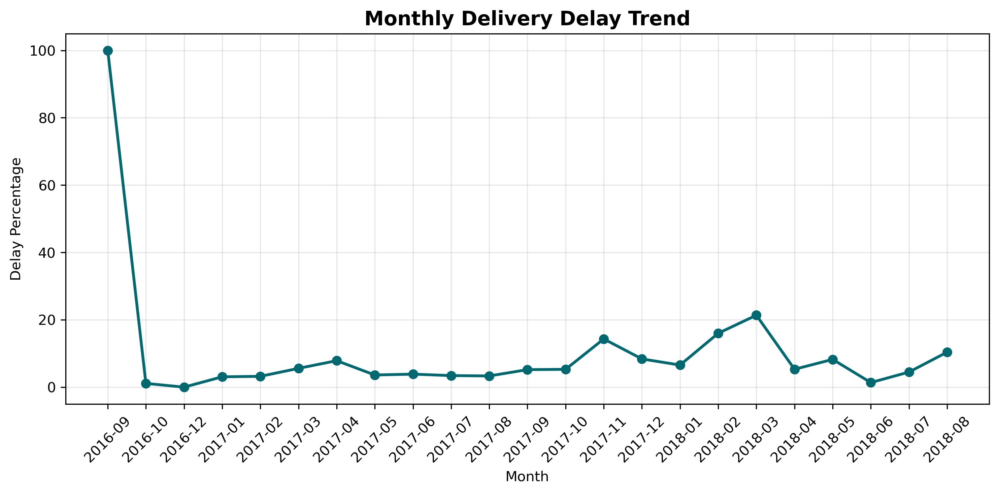
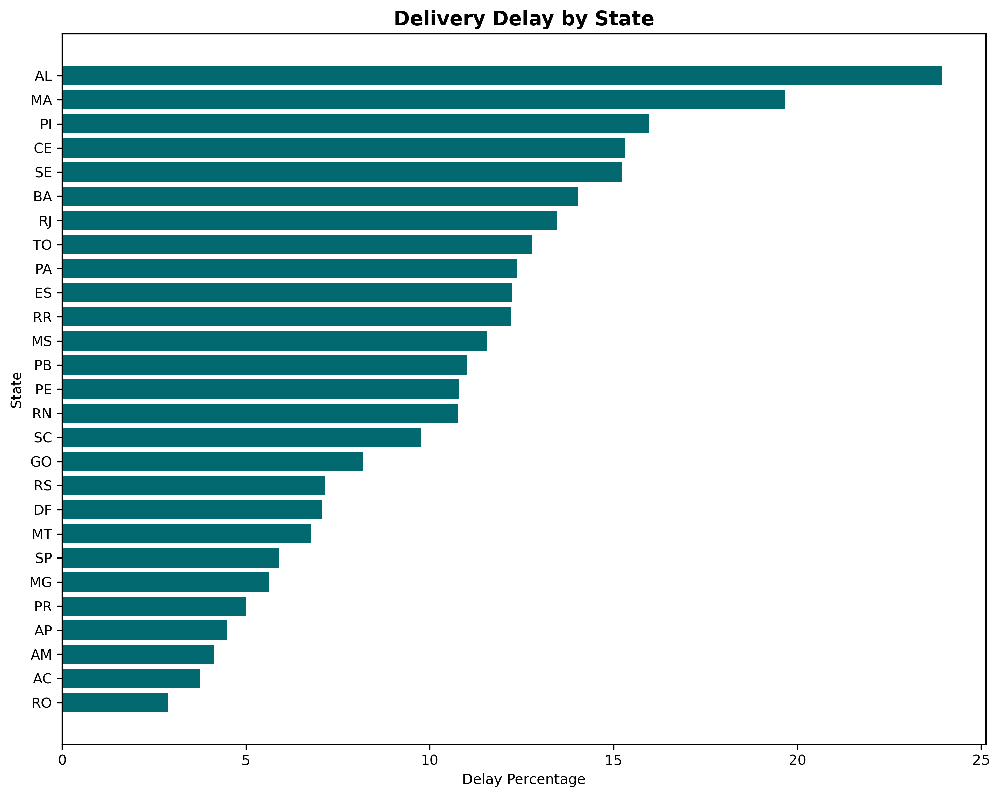
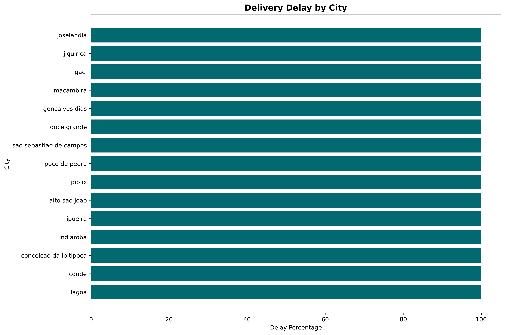
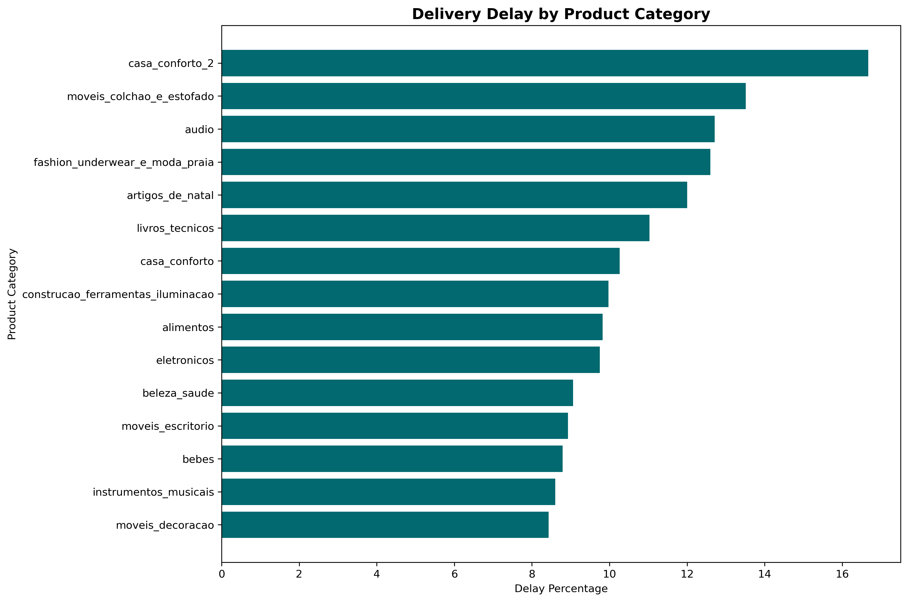
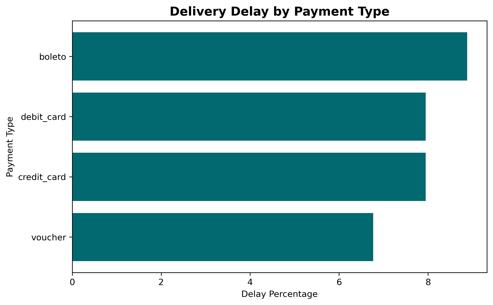

# 🚚 Delivery Delay & Customer Experience Dashboard

A professional analytics dashboard built with Streamlit to explore e-commerce delivery delay patterns across time, geography, product categories, and payment methods.

## 🎯 Live Demo
👉 [**Open Dashboard**](https://delivery-delay-analytics.streamlit.app)

*If you're using a custom subdomain during deployment, the URL will look like:*  
`https://delivery-delay-analytics.streamlit.app`

## 📦 Overview
This project analyzes e-commerce delivery performance using **SQL** for data extraction and **Python with Streamlit** for interactive visualization. The objective is to identify delivery delay patterns across time, geography, product categories, and payment methods.

## 🧭 Problem Statement
Late deliveries affect customer satisfaction and operational efficiency in e-commerce. This project investigates where and when delays happen most often and highlights the business dimensions associated with higher delivery risk.

## 🎯 Objectives
- Measure the overall level of delivery delays.
- Track monthly delivery delay trends.
- Identify states and cities with the highest delay percentages.
- Analyze product categories associated with higher delays.
- Compare delay rates across payment types.
- Provide an **interactive dashboard** for dynamic exploration instead of static charts.

## 🧰 Tools and Technologies
| Layer | Technology |
|-------|------------|
| Database | MySQL |
| Data Processing | Python, Pandas |
| Visualization | Plotly |
| Dashboard | Streamlit Community Cloud |
| Version Control | Git, GitHub |
| Hosted App | Streamlit Community Cloud + GitHub Actions |

## 📂 Repository Structure
```bash
delivery-delay-cx-analytics/
│── charts/               # Chart images for README
│── exports/              # CSV exports used by dashboard
│── dashboard/            # Streamlit app
│   └── app.py
│── notebooks/            # Data analysis notebooks
│── data/                 # Raw & processed data (excluded from repo)
│── README.md
│── requirements.txt
│── .gitignore
```

> **Note:** Raw dataset files are excluded from the repository to keep it clean. Use your local dataset or access the live dashboard.

## 🔄 Workflow
1. Load and clean the dataset.
2. Run SQL queries to calculate:
   - Total orders
   - Delayed orders
   - Delay percentage
3. Export aggregated query results as CSV files.
4. The **Streamlit dashboard** loads these CSVs and renders dynamic plots with Plotly.
5. Users can interactively filter and explore data through the sidebar.

## 📊 Dashboard Features
The interactive Streamlit dashboard includes:

### 1. Executive Overview
- KPI cards showing Total Orders, Delayed Orders, and Average Delay %
- Quick understanding of overall delivery health

### 2. Monthly Trend
- Interactive line chart showing delivery delay trends over time
- Hover to inspect exact delay percentages per month

### 3. State Analysis
- Horizontal bar chart of delay percentages across states
- Compare regional performance

### 4. City Analysis
- Top 20 cities ranked by delay percentage
- Identify urban logistics hotspots

### 5. Category Analysis
- Product categories with highest delay risk
- Helps identify categories requiring logistics improvement

### 6. Payment Analysis
- Delay distribution across payment types
- Investigate whether payment method affects delivery speed

### Static Visualizations for Reference
#### Monthly Delay Trend


#### Delay by State


#### Delay by City


#### Delay by Category


#### Delay by Payment


## 🔍 Key Insights
- Delivery delays do not occur uniformly and vary across different months.
- Some states and cities experience noticeably higher delay percentages.
- Product category appears to influence delivery performance significantly.
- Payment type has relatively smaller impact compared to geography and category.
- Geographic and category-based analysis provides stronger operational insight than overall totals.

## 🧩 Project Outputs
- Aggregated SQL query outputs exported as CSV files
- Interactive Streamlit dashboard for dynamic data exploration
- Professional dashboard with sidebar navigation
- Organized repository with clear separation of concerns
- README documentation with findings and visuals

## 🛠️ How to Run Locally
```bash
# Clone the repository
git clone https://github.com/Atharva778-beep/delivery-delay-cx-analytics.git
cd delivery-delay-cx-analytics

# Install dependencies
pip install -r requirements.txt

# Run the dashboard
streamlit run dashboard/app.py
```

## 📤 Live Deployment
The dashboard is deployed on **Streamlit Community Cloud**.  
Visit the live app:  
👉 [Open Live Dashboard](https://delivery-delay-analytics.streamlit.app)

## 💡 Business Value
This analysis helps identify delivery bottlenecks and provides data-backed insight into where logistics improvements may be needed. The findings can support better inventory planning, courier strategy, regional monitoring, and customer experience improvement.

## 🔮 Future Improvements
- Add seller-level and courier-level delay analysis.
- Compare delivered-on-time vs delayed orders more deeply.
- Include predictive modeling for delivery delay risk.
- Add filters for date range, seller location, and customer segment.
- Add KPI trend charts with month-over-month comparison.

## ✅ What Makes This Project Stand Out
- **Interactive dashboard** instead of static reports
- **Clean professional styling** with custom CSS
- **Mobile-friendly layout**
- **GitHub-hosted + Streamlit-deployed**
- Demonstrates end-to-end **data analytics + dashboarding** skills

## 🧑‍💻 About the Author
**Atharva Sawant**  
Data Analyst & Machine Learning Enthusiast  
GitHub: [Atharva778-beep](https://github.com/Atharva778-beep)